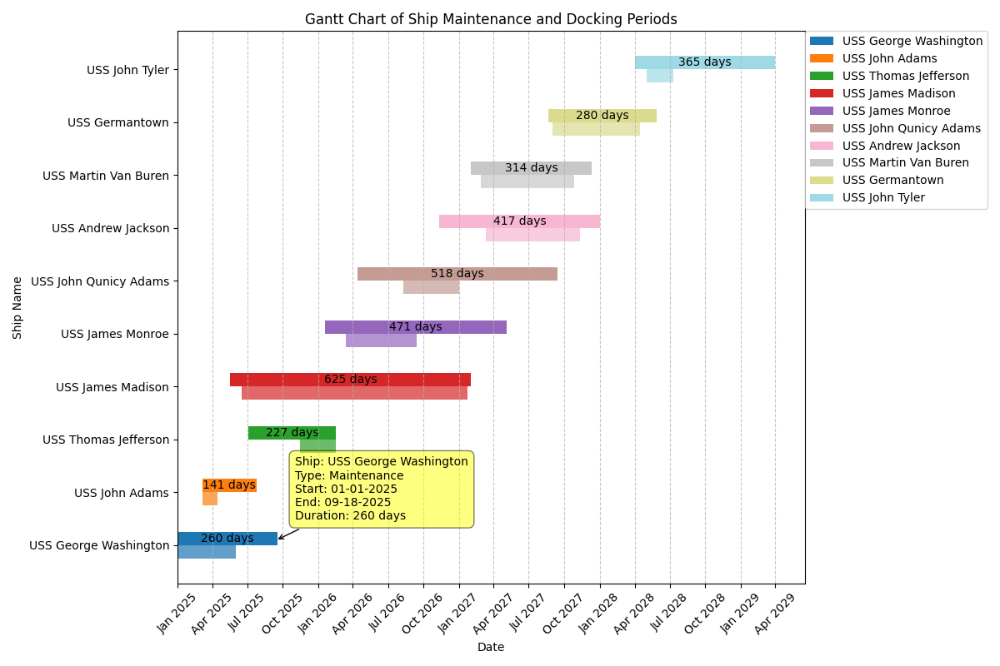
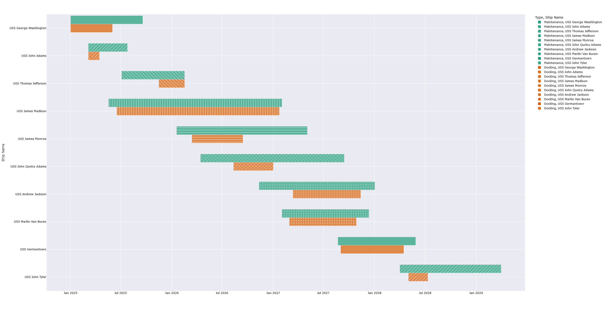

# Sellers & Associates Take Home 
Simple Gantt Chart built with Python, matplotlib, mplcursor, and pandas. 

## Task
The task was to build a Gantt chart with provided information on ships, with their start and end dates for maintenance and docking periods, respectively. 

### The Gantt chart should clearly display:
* Ship names on the vertical axis.
* Dates on the horizontal axis.
* Bars representing the duration of each ship’s Maintenance period, with the start and end points matching the provided dates.
* Bars representing the duration of each ship’s Docking period, with the start and end points matching the provided dates.
    * Docking period bars should be displayed directly below the Maintenance period bars for each respective ship.
* Differentiation between Ships by color or style.

## Steps to replicate
To clone and run this application, you'll need Git and Python 3.12.1 installed on your computer. 
1. Download the repository or clone it using: `git clone https://github.com/HueJanus/SAA-Technical.git`.
2. In the repository, run `pip install -r requirements.txt` to install required libraries.
3. Either run `python main.py` or press your run code button while looking at the `main.py` file.
    - I have also included the attempt with plotly which can found at `plotly_try.py`.

## Approach
In order to read and transform the data given, I used the Python library pandas. I have familiarity with this library, and it is relatively easy to use. I decided to combine both the Maintenance and Docking Start/End Dates into one column. I differentiated which was which using another column called "Type". My reasoning behind this was because I am unaware of any ways of being able to utilize two separate date columns for the same figure. 

For the actual chart, I initially decided to use plotly express along with Python because of its hover utility and ease of use. However, plotly did not give the freedom I needed in order to complete this task with the objectives I wanted to do.
I had run into issues with trying to plot both maintenance and docking times for each ship. I was limited in being able to actually have the docking period bar directly below each maintenance period bar as the objects for each bar are actually bounded by color, meaning I would only have two colors only able to differentiate docking and maintenance periods. That left me with having to use patterns in order to distinguish the ships from each other. I disliked the patterns, so I decided to choose a different library. I really wanted the hover functionality which matplotlib does not have; however, there is a library called mplcursors that allows for hovering to be possible using matplotlib. Although the hovering is not as intuitive, and it's not as fast, I think it does the job well. Utilizing matplotlib allowed me to customize everything about the chart along with curating individual bars. I'm sure I could have done something similar with plotly graph objects, however I have used matplotlib before and felt more comfortable with it. To get the hover data to show up properly, I had to store it in its own array so that I could use it for later, otherwise the data that'd show up while hovering was a for a completely different ship. 

## Features
* Each ship's color is distinct from each other by using matplotlib's tab20 color scheme. 
* Each docking bar is slightly transparent and offset to differentiate itself from its respective maintenance bar.
* Each maintenance bar has is labeled with the number of days it lasts. 
* Hovering over a bar reveals detailed information of the bar, along with an arrow to distinguish what bar it is referring to. 
* The chart is able to zoom in to a specific timeframe, pan, and save images at the current viewpoint. 

#### Gantt Chart using matplotlib

#### Gantt Chart using plotly

## Credits
Tristan Nguyen